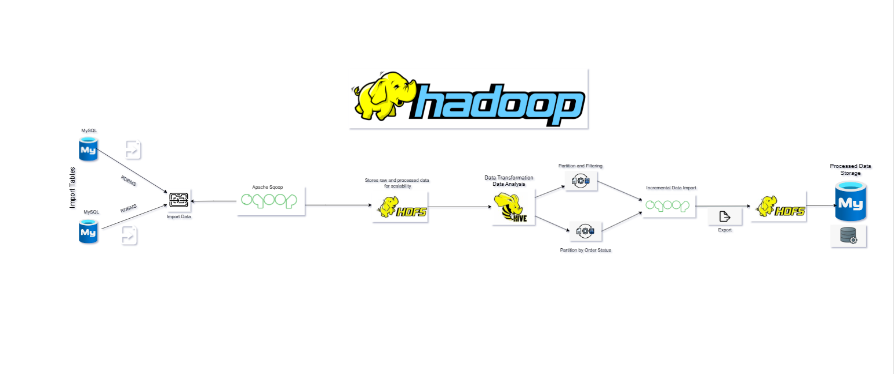

# ETL Pipeline Using Hadoop 

This project demonstrates an ETL (Extract, Transform, Load) pipeline for efficiently moving and transforming data between MySQL, Hadoop, and a local virtual machine using Apache Sqoop, Hive, and HDFS. The pipeline includes importing data from MySQL, storing it in HDFS, transforming it with Hive, and exporting the processed data back to a virtual machine for further use.

## Overview

The pipeline operates in the following steps:

1. **Data Import**: Data is imported from MySQL tables into Hadoop's HDFS using Apache Sqoop.
2. **Data Storage**: Raw and processed data is stored in HDFS for scalability.
3. **Data Transformation**: Hive is used for data analysis, filtering, partitioning, and transformation.
4. **Data Export**: Transformed data is exported back to MySQL or stored in a virtual machine's file system for analysis.

## Workflow Diagram

Below is the visual representation of the pipeline:



## Key Features
- Import data from relational databases (MySQL) into HDFS using Sqoop.
- Perform transformations and analysis on data using Hive.
- Export processed data to local or external storage.
- Supports incremental data import and partitioning for optimized performance.

## Prerequisites
- Hadoop and HDFS installed and configured.
- Apache Hive for data transformation.
- Apache Sqoop for data transfer.
- MySQL database with required permissions.

## Code Overview
The following tools and scripts are used in this project:

- **Apache Sqoop**: For importing and exporting data between MySQL and Hadoop.
  ```bash
  sqoop import \
    --connect jdbc:mysql://localhost:3306/retail_db \
    --username root --password cloudera \
    --table orders \
    --target-dir /user/hive/warehouse/orders_data \
    --incremental append \
    --check-column order_date \
    --last-value "2025-01-01"
  ```

- **Hive**: For data partitioning and filtering.
  ```sql
  CREATE TABLE orders_partitioned (
    order_id INT,
    order_date STRING,
    order_status STRING
  ) PARTITIONED BY (order_month STRING)
  STORED AS PARQUET;

  INSERT OVERWRITE TABLE orders_partitioned
  PARTITION (order_month)
  SELECT order_id, order_date, order_status, 
         substr(order_date, 1, 7) as order_month
  FROM orders;

  -Load data into the Hive table:

   - LOAD DATA INPATH '/user/cloudera/cloud' INTO TABLE orders_hive;

  - Create a partitioned table

    CREATE TABLE orders_partition (
    order_id INT,
    order_date STRING,
    order_customer_id INT )

  PARTITIONED BY (order_status STRING)
  ROW FORMAT DELIMITED
  FIELDS TERMINATED BY ','
  STORED AS TEXTFILE;

    SET hive.exec.dynamic.partition=true;
    SET hive.exec.dynamic.partition.mode=nonstrict;

  INSERT OVERWRITE TABLE orders_partition
  PARTITION (order_status)
  SELECT order_id, order_date, order_customer_id, order_status
  FROM orders_hive;


  SELECT order_status, COUNT(*) AS total_orders FROM orders_hive GROUP BY   order_status;


  SELECT order_id, ord er_customer_id, order_status FROM orders_hive WHERE order_status = 'PENDING';

  INSERT INTO orders VALUES 
  (88875, '2014-07-26 00:00:00', 12347, 'PROCESSING');


  sqoop import --connect jdbc:mysql://localhost:3306/retail_db --username root --password cloudera --table orders --m 1 --incremental append --check-column order_id --last-value 68883 
  --target-dir /user/cloudera/new_recored

  CREATE TABLE orders_process (
    order_id INT PRIMARY KEY,
    order_date DATETIME,
    order_customer_id INT,
    order_status VARCHAR(50)
  );

  ```
- **Enable bucketing for analytics**.
  ```bash
    CREATE TABLE customers_bucket (
    customer_id INT,
    customer_name STRING,
    customer_email STRING,
    customer_city STRING,
    customer_state STRING,
    customer_zipcode STRING )

    CLUSTERED BY (customer_id) INTO 4 BUCKETS
    STORED AS TEXTFILE;

    INSERT OVERWRITE TABLE customers_bucketed
    SELECT * FROM customers_hive;


    ```
-  **Hive Queries**.
  ```bash
    SELECT customer_state, COUNT(*) AS total_customers 
    FROM customers_hive 
    GROUP BY customer_state;

    SELECT customer_name, customer_email 
    FROM customers_hive 
    WHERE customer_state = 'CA';
  ```
-  **Incremental Data Import with Sqoop**.
  ```bash
  INSERT INTO customers VALUES
(4, 'Anna White', 'anna.white@example.com', 'Houston', 'TX', '77001');

sqoop import \
--connect jdbc:mysql://localhost:3306/retail_db \
--username root --password cloudera \
--table customers \
--incremental append \
--check-column customer_id \
--last-value 3 \
--target-dir /user/cloudera/customers_incremental \
--m 1;
  ```
-  **Hive Optimization Techniques**.
  ```bash
Enable compression 
SET hive.exec.compress.output=true;
SET mapreduce.output.fileoutputformat.compress.codec=org.apache.hadoop.io.compress.SnappyCodec;

USE spark execution engine for faster query performance.
SET hive.execution.engine=spark;
```
-  **Export Data to MySQL**.
  ```bash
  CREATE TABLE customers_exported (
    customer_id INT PRIMARY KEY,
    customer_name VARCHAR(100),
    customer_email VARCHAR(100),
    customer_city VARCHAR(50),
    customer_state VARCHAR(50),
    customer_zipcode VARCHAR(20)
);
   ```


- **Data Export**: For exporting Hive data to a local file system.
  ```bash
  sqoop export \
    --connect jdbc:mysql://localhost:3306/retail_db \
    --username root --password cloudera \
    --table orders_exported \
    --export-dir /user/hive/warehouse/orders_partitioned \
    --input-fields-terminated-by ','
  ```

## Getting Started
1. Clone the repository from GitHub.
2. Follow the prerequisites to set up the required tools.
3. Run the scripts sequentially to execute the pipeline.

